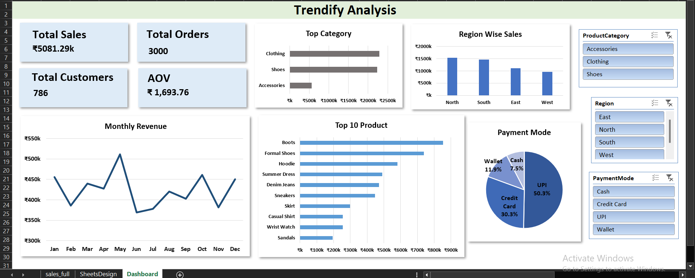
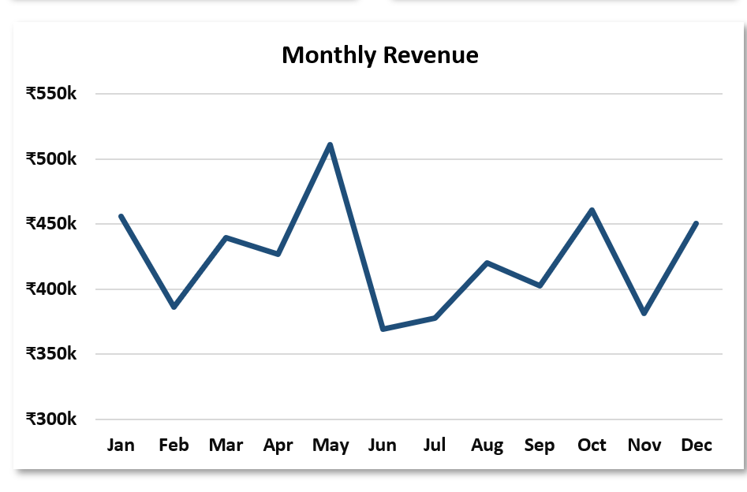
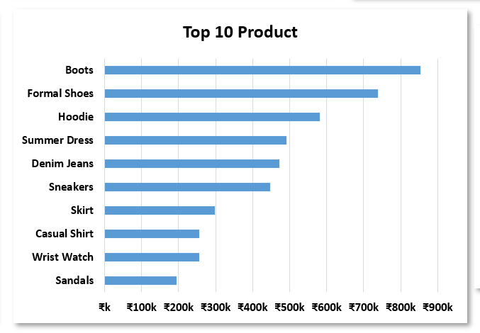
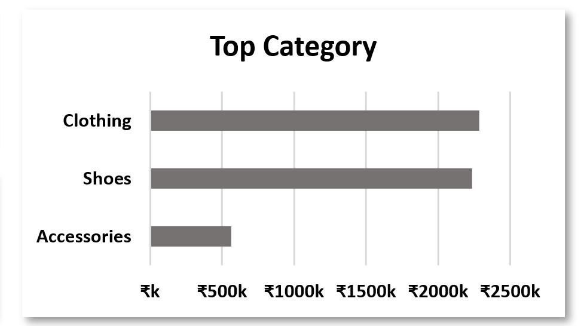
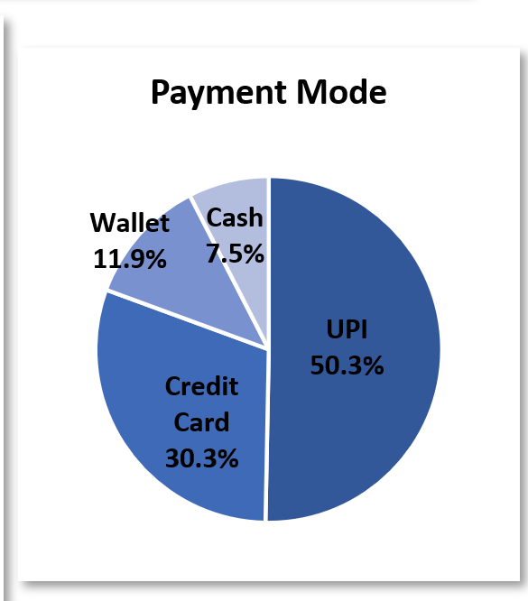

# 📊 Trendify — Sales Analysis

A complete end-to-end **Sales Analysis Project** built using **SQL + Excel Dashboard + Data Visualization**.  
This repository demonstrates how to clean, analyze and visualize sales data for an e-commerce store.

---

## 🗂 Repository Structure

Trendify-Sales-Analysis/
├─ 01_README.md → Extra project notes (this file is summary)
├─ 02_LICENSE → License of the project
├─ 03_trendify_analysis.sql → Core SQL analysis queries
├─ 04_Trendify_Final_Deliverables.zip → Packaged deliverables
├─ 05_dashboard/ → Interactive Excel Dashboard
│ └─ Trendify_sales.xlsb.xlsx
├─ 06_data/ → Datasets used
│ ├─ raw/ → Raw input CSVs
│ │ ├─ trendify_mini_ecommerce_3000.csv
│ │ ├─ sales_full.csv
│ │ └─ unique_customers.csv
│ └─ public_sample/ → Public/safe shareable data
├─ 07_sql/ → SQL scripts
│ └─ trendify_analysis.sql
├─ 08_images/ → Screenshots & visuals
│ ├─ Monthly.png
│ ├─ TopProducts.png
│ ├─ Category.png
│ ├─ Payment.png
│ └─ trendify_dashboard.png

---

## 🚀 Project Overview

- **Objective:** Analyze sales transactions of an e-commerce company to uncover trends, top products, customer insights, and payment preferences.  
- **Tech stack used:**
  - SQL → querying, aggregation, KPI calculation
  - Excel → dashboard creation (pivot tables, charts, slicers)
  - Data Visualization → clear communication of insights
- **Final Deliverable:** Interactive Excel dashboard + SQL analysis scripts + screenshots.

---

## 📸 Dashboard & Visuals

### 🔹 Overall Dashboard

### 🔹 Monthly Sales Trend

### 🔹 Top Selling Products

### 🔹 Sales by Category

### 🔹 Payment Methods Breakdown

---

## 📊 Key Insights
1. 📈 **Monthly Trend:** Sales peak during festive/holiday months.  
2. 🛍 **Top Products:** A handful of SKUs drive a majority of revenue.  
3. 🗂 **Categories:** Electronics & Apparel dominate overall sales.  
4. 💳 **Payments:** Digital payments > COD, showing customer trust in online transactions.  

---

## 📥 How to Use This Repo

1. **SQL Analysis** → Open [`07_sql/trendify_analysis.sql`](07_sql/trendify_analysis.sql) in your SQL client and run queries on the raw dataset.  
2. **Excel Dashboard** → Open [`05_dashboard/Trendify_sales.xlsb.xlsx`](05_dashboard/Trendify_sales.xlsb.xlsx).  
   - Contains Pivot tables, KPIs, slicers for category, region, and payment.  
3. **Screenshots** → Explore visuals in [`08_images/`](08_images/).  
4. **Documentation** → Additional docs available in [`09_docs/`](09_docs/).  

---

## 📦 Deliverables
- **SQL script** with queries for sales trend, top customers, products, categories, etc.  
- **Interactive Excel Dashboard** for end-user exploration.  
- **Final Packaged ZIP** in [`04_Trendify_Final_Deliverables.zip`](04_Trendify_Final_Deliverables.zip).  

---

## ⚖️ License
This project is shared under the [MIT License](02_LICENSE).  
You are free to use and modify with attribution.

---

## 🤝 Contributing
1. Fork the repo  
2. Create a new branch (`feature/your-feature`)  
3. Commit your changes  
4. Push & open a Pull Request  

---

## ⭐ Acknowledgements
Built as a **data analysis portfolio project** demonstrating SQL + Excel + Visualization workflow.
